# ✅ Bem-vindo(a) ao meu GitHub! ✅

  

# 👋 Olá, eu sou o Edson Vaz

### Engenheiro Informático e de Computadores | Técnico de Suporte IT | Programador | Administração de Sistemas

---

## 👨🏽‍💻 Sobre mim

- 🎓 Licenciado em **Engenharia Informática e de Computadores** (UNICV), especialização em Programação
- 💻 **Técnico Informático** com mais de 3 anos de experiência em suporte técnico, manutenção de hardware/software e administração de sistemas
- 🛡️ Experiência com **sistemas ERP empresariais** (Primavera) e suporte a redes
- 🤖 Apaixonado por **Inteligência Artificial**, visão computacional e sistemas de reconhecimento facial
- 🏆 Projeto Final de Curso: *"Sistema Inteligente de Monitorização e Segurança com Reconhecimento Facial Integrado do RS²Lab"* — classificação final de **18 valores**
- 📍 Baseado em Praia, Santiago, Cabo Verde
- 🌱 Atualmente a aprofundar conhecimentos em **Python aplicado a IA** (OpenCV, PyTorch, YOLO, Gemini API)
- ⚡ Gosto de resolver problemas técnicos, automatizar processos e construir soluções tecnológicas úteis

---

## 🔧 Linguagens e Programação

## 🌐 Desenvolvimento Web e Frameworks

## 🗃️ Bancos de Dados

## 📊 Business Intelligence e Análise de Dados

## 🤖 Inteligência Artificial, IoT e Visão Computacional

## 🛠️ Ferramentas, IDEs e Plataformas

## 💼 Sistemas Empresariais e Suporte Técnico

## 🎨 Design e Colaboração

## 🌍 Idiomas

---

## 🚀 Projetos em destaque

### 🔐 SI-MS RS²Lab — Sistema Inteligente de Monitorização e Segurança

Sistema com **reconhecimento facial integrado**, desenvolvido para o laboratório de investigação RS²Lab da Universidade de Cabo Verde. Combina IA, IoT e visão computacional para vigilância inteligente.

`Python` `Django REST Framework` `React.js` `JavaScript` `Face-api.js` `Arduino` `ESP32` `MQTT` `Node-RED`

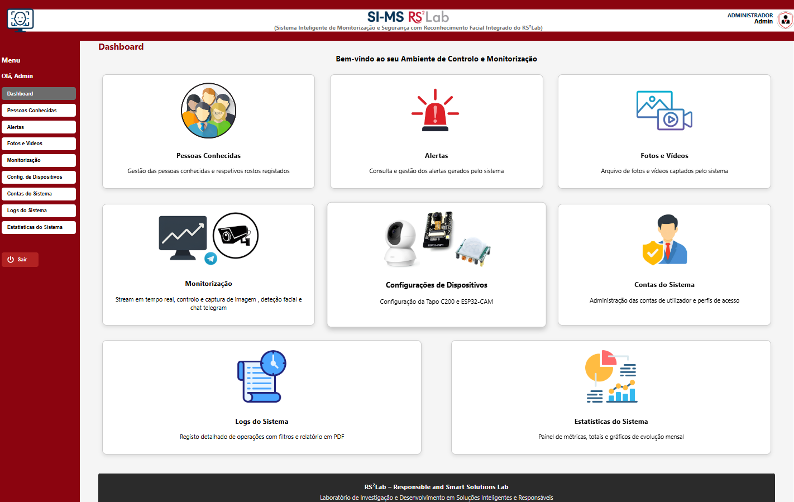
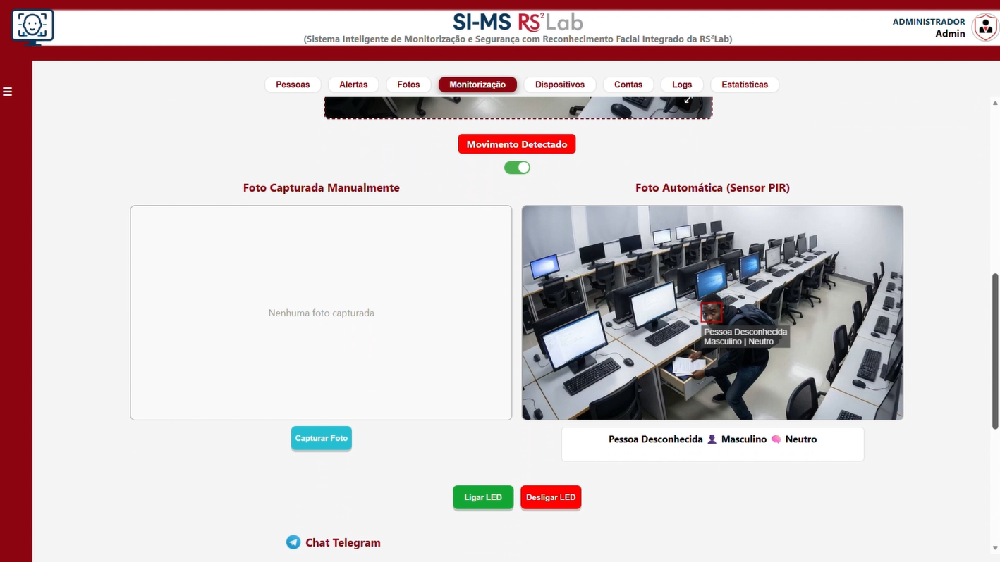

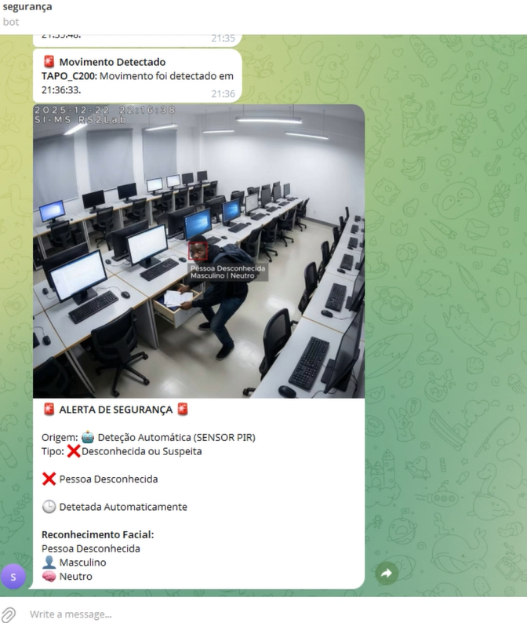
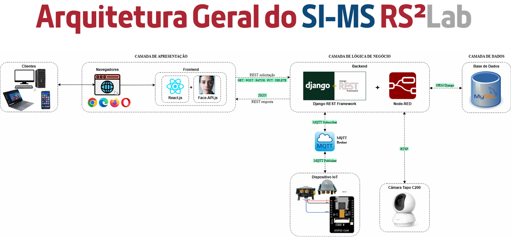

### 🏢 Website ICUB — Sistema de Gestão de Incubadora de Inovação
Plataforma web para gestão da Incubadora de Inovação da Universidade de Cabo Verde.
`PHP` `HTML` `MySQL`
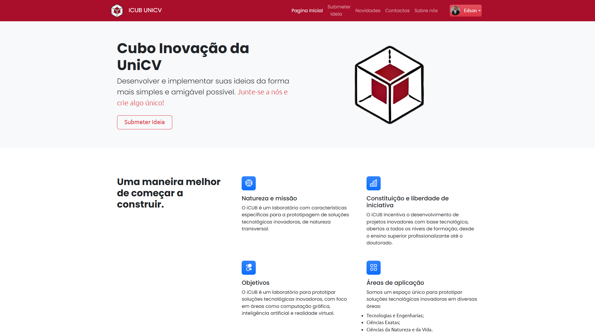
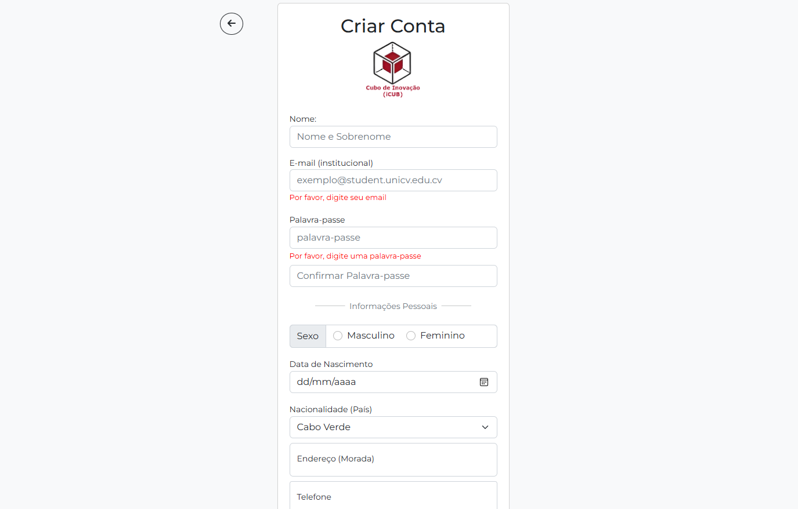

### 📚 SGDB — Sistema de Gestão de Biblioteca
Aplicação desktop para gestão de biblioteca, com interface gráfica.
`Java` `Apache NetBeans IDE` `SceneBuilder` `SQL Server`

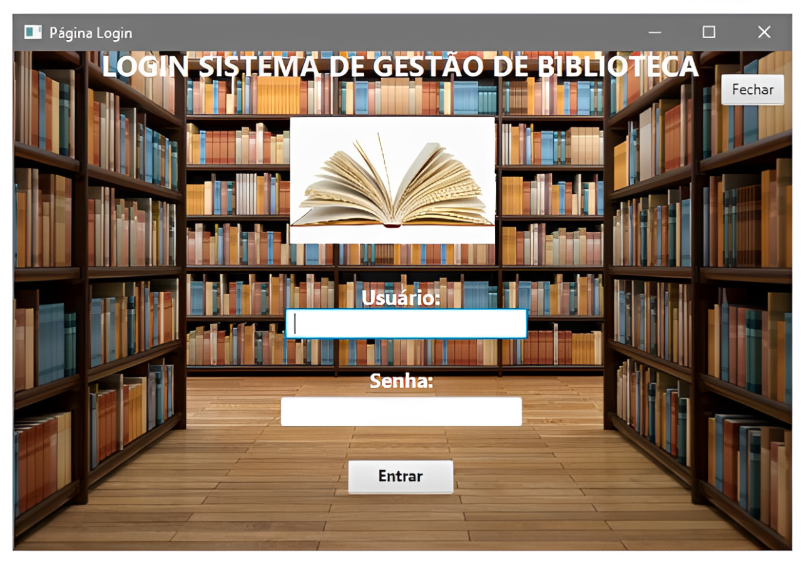

### 🧭 GTR — Guia Turismo Responsável
Aplicação móvel Android para promoção do turismo responsável.
`Kotlin` `Java` `Android Studio`
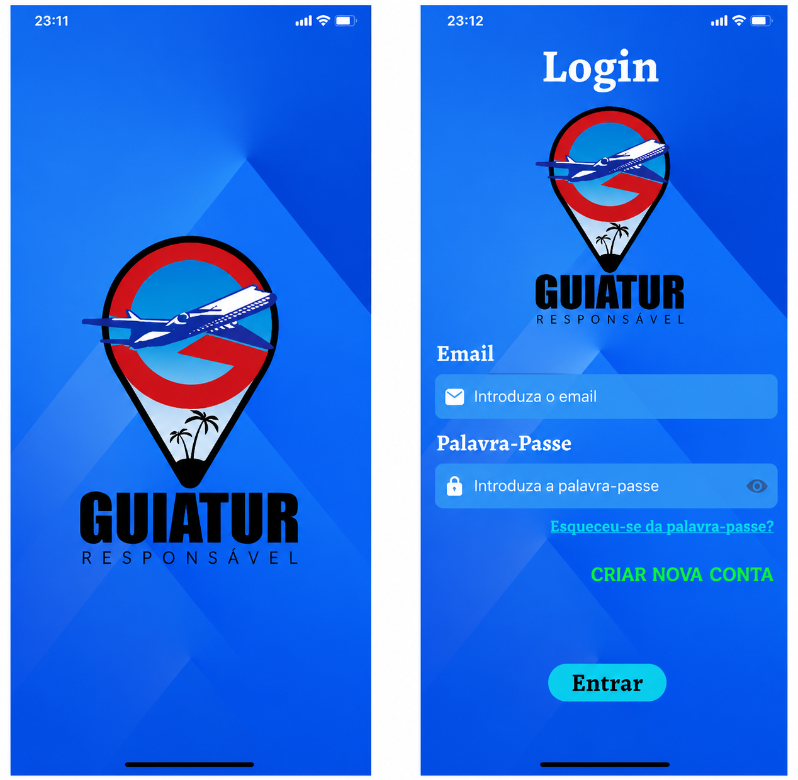

### 🎮 Attack on Titan — Jogo 2D de Ação e Sobrevivência
Jogo 2D desenvolvido como projeto pessoal de desenvolvimento de jogos.
`C#` `Unity`
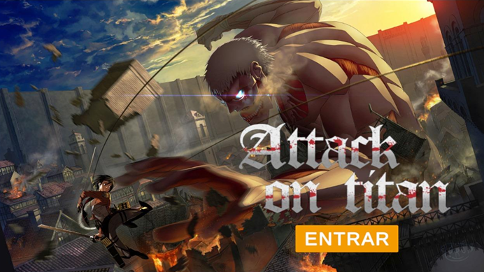
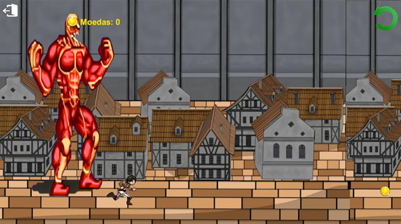

### 🐍 NLW Operator – Python (Rocketseat)
Formação prática em Python aplicado a IA e visão computacional, com inferência em tempo real.
`Python` `OpenCV` `MediaPipe` `PyTorch` `Scikit-Learn` `YOLO` `Gemini API`

**📜 Certificado:**

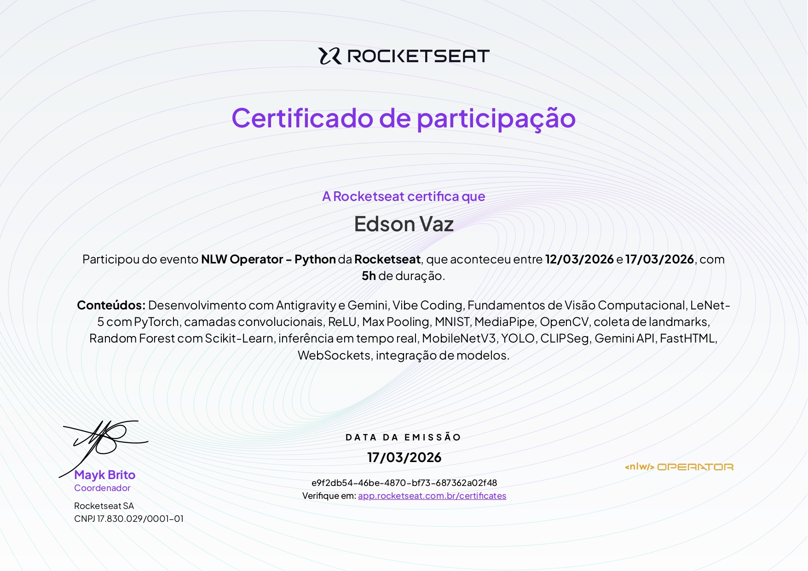
---

## 📊 Estatísticas do GitHub

---

## 📲 Conecte-se comigo

<i>"Qualquer tecnologia suficientemente avançada é indistinguível de magia." — Arthur C. Clarke</i>

